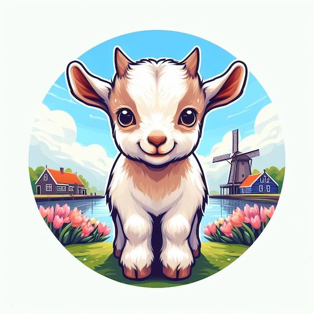
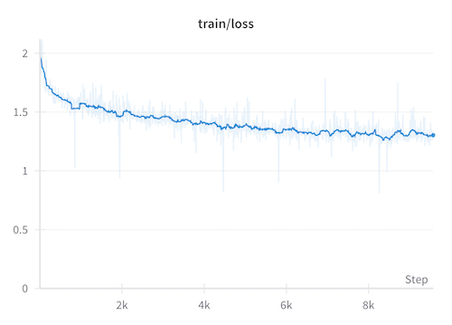
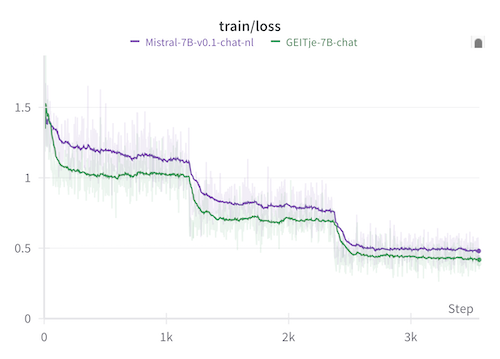
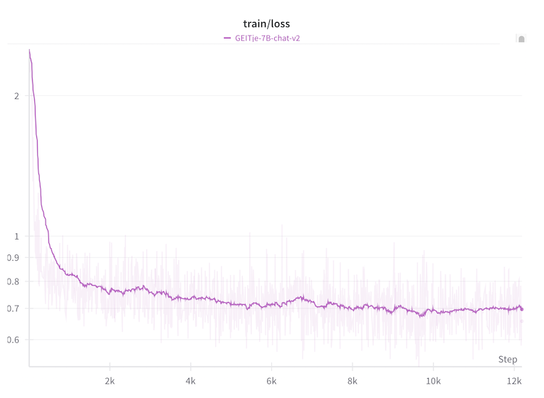
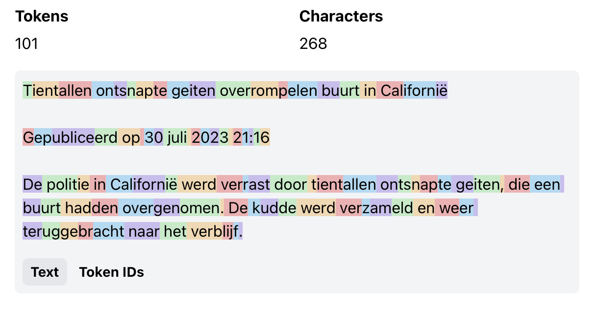
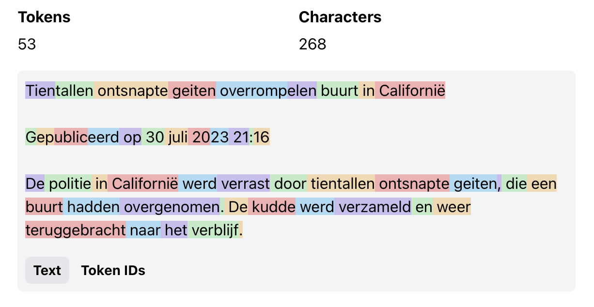

🐐 GEITje 7B: A Large Open Dutch Language Model
===============================================
[📄 Dutch README](https://github.com/Rijgersberg/GEITje) | 🤖️ [GEITje-chat-v2 demo](https://huggingface.co/spaces/Rijgersberg/GEITje-7B-chat)️

GEITje is a large open Dutch language model with 7 billion parameters, based on Mistral 7B.
It has been further trained on 10 billion tokens of Dutch text.
This has improved its Dutch language skills and increased its knowledge of Dutch topics.

**Update 18 December 2023**: Release of GEITje-7B-chat-v2, trained on a lot more translated chat conversations.




📜 License
----------
GEITje is open-source under the Apache 2.0 license.
This means that, unlike ChatGPT, for example, you can run GEITje yourself,
on your own infrastructure and with any (confidential) data you want.
You can also modify or further train the code or the model.


🙋🏻‍♂️ Author
-----------
GEITje is a hobby project by [Edwin Rijgersberg](https://goingdutch.ai).
Have you made something cool with GEITje? I'd love to hear about it!
Send me an [email](mailto:edwin@edwinrijgersberg.nl) or a message on [Twitter](https://twitter.com/E_Rijgersberg) or [Mastodon](https://mastodon.social/@rijgersberg).
Or open an issue here on GitHub, of course.

More background on the development of GEITje can (soon) be found on my blog: [GoingDutch.ai](https://goingdutch.ai).


🤖 Model
--------

### _Mistral_ – Base Model
GEITje is based on [Mistral 7B](https://mistral.ai/news/announcing-mistral-7b/).
It's a large open language model with 7 billion parameters,
trained by [Mistral AI](https://mistral.ai).
According to Mistral AI, the 7B model performs better than [Llama 2](https://ai.meta.com/llama/) 13B on all (English-language) benchmarks they tested it on.
Mistral 7B has been released under the Apache 2.0 open source license.


### _GEITje_ – Trained Further on Dutch Texts
GEITje was created by further training Mistral 7B on no less than 10 billion tokens of Dutch text from the [Dutch Gigacorpus](http://gigacorpus.nl) and the [MADLAD-400](https://huggingface.co/datasets/allenai/MADLAD-400) web crawling corpus.
It is a so-called _full-parameter finetune_: 
performed on all parameters.
It is not a [PEFT](https://huggingface.co/blog/peft) or [LoRA](https://huggingface.co/docs/peft/conceptual_guides/lora) finetune.
Like Mistral, GEITje has a _context length_ of 8,192 tokens.


### _GEITje-chat_ – Finetuned for Dialogues
As a demonstration of GEITje's capabilities for chat applications, two initial chat variants of GEITje have also been finetuned: GEITje-chat and GEITje-chat-v2.
They can follow instructions, answer questions, and hold dialogues on a variety of topics.

### Variants

| Model       | Version | Parameters | Type         | Link to 🤗 Hugging Face Models                                                                                                                                   | Based on                                                            |
|-------------|---------|------------|--------------|------------------------------------------------------------------------------------------------------------------------------------------------------------------|---------------------------------------------------------------------|
| GEITje      | v1      | 7B         | _foundation_ | [GEITje-7B](https://huggingface.co/Rijgersberg/GEITje-7B)                                                                                                        | [Mistral-7B-v0.1](https://huggingface.co/mistralai/Mistral-7B-v0.1) |
| GEITje-chat | v1      | 7B         | _chat_       | [GEITje-7B-chat](https://huggingface.co/Rijgersberg/GEITje-7B-chat) <br><small>([gguf](https://huggingface.co/Rijgersberg/GEITje-7B-chat-gguf))</small>          | [GEITje-7B](https://huggingface.co/Rijgersberg/GEITje-7B)️          |
|             | v2      | 7B         | _chat_       | [GEITje-7B-chat-v2](https://huggingface.co/Rijgersberg/GEITje-7B-chat-v2) <br><small>([gguf](https://huggingface.co/Rijgersberg/GEITje-7B-chat-v2-gguf))</small> | [GEITje-7B](https://huggingface.co/Rijgersberg/GEITje-7B)️          |


🚀 Usage
--------

### Demo
Chat with GEITje-chat-v2 in the [demo](https://huggingface.co/spaces/Rijgersberg/GEITje-7B-chat) on 🤗 Hugging Face Spaces.


### 🤗 Transformers
GEITje is best used with [🤗 Hugging Face Transformers](https://huggingface.co/docs/transformers/index).


```python
from transformers import pipeline, Conversation


chatbot = pipeline(task='conversational', model='Rijgersberg/GEITje-7B-chat-v2',
                   device_map='auto')

print(chatbot(
    Conversation('Welk woord hoort er niet in dit rijtje thuis: "auto, vliegtuig, geitje, bus"?')
))
# Conversation id: 602cfe35-614d-4df1-bdb5-2e29038f1d04
# user: Welk woord hoort er niet in dit rijtje thuis: "auto, vliegtuig, geitje, bus"?
# assistant: "Geitje" is het woord dat niet in dit rijtje thuishoort. Het rijtje bestaat uit allemaal vervoersmiddelen.
```

Or, if you prefer more control:
```python
import torch
from transformers import AutoModelForCausalLM, AutoTokenizer


device = 'cuda' if torch.cuda.is_available() else 'cpu'

model_name = 'Rijgersberg/GEITje-7B-chat-v2'
model = AutoModelForCausalLM.from_pretrained(model_name, torch_dtype=torch.bfloat16,
                                             low_cpu_mem_usage=True, use_flash_attention_2=True,
                                             device_map=device)
tokenizer = AutoTokenizer.from_pretrained(model_name)

def generate(conversation, temperature=0.2, top_k=50, max_new_tokens=1_000):
    tokenized = tokenizer.apply_chat_template(conversation, add_generation_prompt=True,
                                              return_tensors='pt').to(device)
    outputs = model.generate(tokenized, do_sample=True, temperature=temperature,
                             top_k=top_k, max_new_tokens=max_new_tokens)

    return tokenizer.decode(outputs[0], skip_special_tokens=True)

conversation = [
    {
        'role': 'user',
        'content': 'Welk woord hoort er niet in dit rijtje thuis: "auto, vliegtuig, geitje, bus"?'
    }
]
print(generate(conversation))
# <|user|>
# Welk woord hoort er niet in dit rijtje thuis: "auto, vliegtuig, geitje, bus"? 
# <|assistant|>
# Het woord dat niet op zijn plaats staat is 'geit'. Een geit zou niet tussen een lijst van vervoersmiddelen moeten staan. Het past beter bij een boerderijthema of dierenlijst.
```

### Safety and Deployment in Production
GEITje is a [foundation model](https://en.wikipedia.org/wiki/Foundation_models).
It is trained to complete texts and is not optimized for dialogue applications.

To apply GEITje yourself, you can fine-tune it on your own dataset.
If you deploy it in production,
make sure you have sufficient _guardrails_ in your training set to safely apply the model.

The GEITje-chat dialogue dataset also contains some examples of chat conversations where the assistant refuses to respond,
but the model has not undergone advanced _alignment_.
Therefore, it is possible that it generates problematic output, especially if it is _prompted_ to do so.

Also note that while Mistral 7B as a model is open source,
Mistral AI has not disclosed on which data it has been trained.
It is therefore also unknown if undesirable material was included in it.
The training data for GEITje and GEITje-chat, on the other hand, are transparent.
See the following paragraphs for this.


📊 Performance
--------------

⚠️ Work in progress ⚠️.

The evaluation of Dutch language models is still in its infancy,
but significant progress has been made recently.

Want to contribute? Make a PR or open an issue here on GitHub!


### Perplexity

Measured _perplexity_ on [yhavinga/mc4_nl_cleaned](https://huggingface.co/datasets/yhavinga/mc4_nl_cleaned),
the _validation_ split of the _tiny_ subset. Reproducible with `eval.py`.

| Model                                        | Parameters                                                              | Perplexity (lower is better) |
|----------------------------------------------|-------------------------------------------------------------------------|------------------------------|
| GEITje                                       | [7B](https://huggingface.co/Rijgersberg/GEITje-7B)                      | **4.70**                     |
| Mistral                                      | [7B](https://huggingface.co/mistralai/Mistral-7B-v0.1)                  | 7.99                         |
| LLaMA 2                                      | [7B](https://huggingface.co/meta-llama/Llama-2-7b-hf)                   | 8.91                         |
|                                              | [13B](https://huggingface.co/meta-llama/Llama-2-13b-hf)                 | 7.87                         |                                                                               |
|                                              | [70B](https://huggingface.co/meta-llama/Llama-2-70b-hf) (8-bit)         | 6.44                         |                                                                                  |
| BramVanroy/llama2-13b-ft-mc4_nl_cleaned_tiny | [13B](https://huggingface.co/BramVanroy/llama2-13b-ft-mc4_nl_cleaned_tiny) | 6.62                         |
| Falcon                                       | [7B](https://huggingface.co/tiiuae/falcon-7b)                           | 25.13                        |
|                                              | [40B](https://huggingface.co/tiiuae/falcon-40b) (8-bit)                 | 6.70                         |
| BramVanroy/falcon-7b-ft-mc4_nl_cleaned_tiny  | [7B](https://huggingface.co/BramVanroy/falcon-7b-ft-mc4_nl_cleaned_tiny) | 9.22                         |
| BLOOM                                        | [7B](https://huggingface.co/bigscience/bloom-7b1)                       | 34.80                        |

### Open Dutch LLM Evaluation Leaderboard

Good datasets for evaluating language models containing untranslated, original Dutch data are scarce.

Recently, however, a leaderboard has been initiated for the performance of LLMs in Dutch:
The [Open Dutch LLM Evaluation Leaderboard](https://huggingface.co/spaces/BramVanroy/open_dutch_llm_leaderboard).
It uses four datasets (automatically translated from English) from the [Language Model Evaluation Harness](https://github.com/EleutherAI/lm-evaluation-harness).

I've used it to evaluate these four models:

| Model name                                                                            | Foundation model | Continued training on             | Finetuned on                                                                                                                                                                                                                                                |
|---------------------------------------------------------------------------------------|------------------|-----------------------------------|-------------------------------------------------------------------------------------------------------------------------------------------------------------------------------------------------------------------------------------------------------------|
| [GEITje-7B](https://huggingface.co/Rijgersberg/GEITje-7B)                             | mistral-7b-v0.1  | - GigaCorpusNL<br>- MADLAD-400-nl |                                                                                                                                                                                                                                                             |
| [Mistral-7B-v0.1-chat-nl](https://huggingface.co/Rijgersberg/Mistral-7B-v0.1-chat-nl) | mistral-7b-v0.1  |                                   | - [no_robots_nl](https://huggingface.co/datasets/Rijgersberg/no_robots_nl)<br>- [ultrachat_10k_nl](https://huggingface.co/datasets/Rijgersberg/ultrachat_10k_nl)                                                                                            |
| [GEITje-7B-chat](https://huggingface.co/Rijgersberg/GEITje-7B-chat)                   | mistral-7b-v0.1  | - GigaCorpusNL<br>- MADLAD-400-nl | - [no_robots_nl](https://huggingface.co/datasets/Rijgersberg/no_robots_nl)<br>- [ultrachat_10k_nl](https://huggingface.co/datasets/Rijgersberg/ultrachat_10k_nl)                                                                                            |
| [GEITje-7B-chat-v2](https://huggingface.co/Rijgersberg/GEITje-7B-chat-v2)             | mistral-7b-v0.1  | - GigaCorpusNL<br>- MADLAD-400-nl | - [no_robots_nl](https://huggingface.co/datasets/Rijgersberg/no_robots_nl)<br>- [ultrachat_10k_nl](https://huggingface.co/datasets/Rijgersberg/ultrachat_10k_nl)<br>- [dutch_chat_datasets](https://huggingface.co/datasets/BramVanroy/dutch_chat_datasets) |

Below is a snapshot as of December 2023.
Models trained by me are displayed in _italics_.

| Model                             | Average  | ARC      | HellaSwag | MMLU     | TruthfulQA |
|-----------------------------------|----------|----------|-----------|----------|------------|
| zephyr-7b-beta                    | **0.49** | 0.43     | 0.58      | **0.43** | **0.53**   |
| _mistral-7b-v0.1-chat-nl_*        | 0.48     | 0.42     | 0.63      | 0.37     | 0.49       |
| _GEITje-7B-chat_                  | 0.47     | 0.42     | **0.67**  | 0.33     | 0.46       |
| neural-chat-7b-v3-1               | 0.47     | **0.43** | 0.58      | 0.34     | 0.51       |
| _GEITJE-7B-chat-v2_*              | 0.46      | 0.42     | 0.65      | 0.33     | 0.45       |
| mistral-7b-v0.1                   | 0.46     | 0.42     | 0.58      | 0.37     | 0.45       |
| orca-2-13b                        | 0.45     | 0.42     | 0.54      | 0.37     | 0.50       |
| _GEITje-7B_                       | 0.45     | 0.38     | 0.65      | 0.32     | 0.43       |
| llama-2-13b-chat-hf               | 0.44     | 0.41     | 0.55      | 0.37     | 0.43       |
| llama2-13b-ft-mc4_nl_cleaned_tiny | 0.44     | 0.40     | 0.58      | 0.35     | 0.42       |
| llama-2-13b-chat-dutch            | 0.43     | 0.38     | 0.56      | 0.35     | 0.44       |
| llama-2-13b-hf                    | 0.43     | 0.38     | 0.57      | 0.36     | 0.41       |
| orca-2-7b                         | 0.41     | 0.37     | 0.49      | 0.33     | 0.45       |
| llama-2-7b-chat-hf                | 0.41     | 0.36     | 0.49      | 0.33     | 0.44       |
| llama-2-7b-hf                     | 0.40     | 0.36     | 0.51      | 0.32     | 0.41       |

A preliminary conclusion from this could be that further training has especially helped to significantly increase the [HellaSwag](https://rowanzellers.com/hellaswag/) score for _common sense reasoning_.
However, this apparently did not lead to better results in the other benchmarks.

**Note**: only after running the evaluations did I realize that the Open Dutch LLM Evaluation Leaderboard evaluates all models in 8-bit mode.
I evaluated my models in `bfloat16`, so the results may not be comparable.
They have been marked with an asterix*.
As soon as the GEITje models are officially included in the leaderboard, I will update the above table with the scores.

### DUMB: A Benchmark for Smart Evaluation of Dutch Models
Wietse de Vries, Martijn Wieling, and Malvina Nissim from [GroNLP](https://www.rug.nl/research/clcg/research/cl/) have recently compiled the [DUMB benchmark](https://github.com/wietsedv/dumb) ([website](https://dumbench.nl), [paper](https://arxiv.org/abs/2305.13026)).

Although it seems designed for _masked language models_ like BERT and RoBERTa, it would be interesting to see how well GEITje performs on it in zero-shot, few-shot, and finetuned settings.


📚 Pre-training of GEITje
-------------------------
The source code of GEITje is available, and the training dataset is compiled from other sources.
The code for compiling the dataset is also available.
So, you can reproduce the model yourself.

### Training Data
Geitje is trained on a subset of [het Nederlandse Gigacorpus](http://gigacorpus.nl) and [MADLAD-400](https://huggingface.co/datasets/allenai/MADLAD-400).

| Source           | Subset       | Tokens in source | Selected tokens | Epochs   | Percentage of total |
|------------------|--------------|------------------|-----------------|----------|---------------------|
| Gigacorpus       | subtitles    | 300 M            | 100 M           | 0.33     | 1 %                 |
| Gigacorpus       | wiki         | 375 M            | 1,125 M         | 3        | 11 %                |
| Gigacorpus       | twitter      | 545 M            | 545 M           | 1        | 5 %                 |
| Gigacorpus       | recht        | 2,300 M          | 250 M           | 0.11     | 3 %                 |
| Gigacorpus       | books        | 11,100 M         | 1,800 M         | 0.16     | 18 %                |
| Gigacorpus       | articles     | 107 M            | 321 M           | 3        | 3 %                 |
| Gigacorpus       | fora         | 42,500 M         | 1,000 M         | 0.02     | 10 %                |
| Gigacorpus-extra | dbnl         | 2,000 M          | 100 M           | 0.05     | 1 %                 |
| Gigacorpus-extra | kamerstukken | 2,900 M          | 250 M           | 0.09     | 3 %                 |
| MADLAD-400       | nl, clean    | 115,000 M        | 4,500 M         | 0.04     | 45 %                |
| **Totaal:**      |              | **177,100 M**    | **9,997 M**     | **0.06** | **100 %**           |

Follow this process to reproduce the dataset yourself

1. Download the Gigacorpus torrent from [gigacorpus.nl](http://gigacorpus.nl).
2. Extract all files
3. Run `gigacorpus2hf.py` to parse the large text files into separate documents in Hugging Face Datasets. Note! This can take up quite a bit of disk space. By default, the datasets are immediately uploaded to the Hugging Face Hub. The files from Gigacorpus-extra are currently not public.
4. Run `create_geitje_dataset.py` to compile the training dataset from the Hugging Face Datasets of Gigacorpus and MADLAD-400.


### Pretrain Code

Pretrain code is available in `pretrain.py`.
The code is based on Hugging Face Transformers and uses the `Trainer` API.
[Flash Attention 2](https://huggingface.co/docs/transformers/perf_infer_gpu_one#flashattention-2) allows for more efficient training on modern GPUs,
and Hugging Face [Accelerate](https://huggingface.co/docs/accelerate/index) for multi-GPU support.

First, install the requirements:
```console
$ python3 -m pip install -r requirements.txt
```

Optionally: log into the Hugging Face Hub and into Weights & Biases with your API-keys:
```console
$ huggingface-cli login
$ wandb login
```

Start training:
```console
$ python3 pretrain.py  # op 1 GPU, of
$ accelerate launch pretrain.py  # meerdere GPUs
```

### Training Progress
For more details about the pretraining, see the [report](https://api.wandb.ai/links/rijgersberg/0wdy6xa2) on Weights & Biases,
or the loss chart below.




💬 Finetuning of GEITje-chat
----------------------------
GEITje-chat is a first demo of possible applications of GEITje.


### Training Data
Unfortunately, there is very little example data of Dutch-language chat conversations publicly available.
[Bram Vanroy](http://bramvanroy.github.io) has made [dutch_chat_datasets](https://huggingface.co/datasets/BramVanroy/dutch_chat_datasets) publicly available:
a dataset of automatically translated question-answer pairs from Dolly, Alpaca, Stack Overflow, and Quora.
But I wanted to train with examples of chats with multiple question-answer rounds,
to better simulate the use of a chatbot.

Therefore, I had two new chat datasets automatically translated by GPT3.5.
See the scripts in `./data/chat/` for the code for this.

1. [**no_robots_nl**](https://huggingface.co/datasets/Rijgersberg/no_robots_nl):
A translated version of all 10k examples from [HuggingFaceH4/no_robots](https://huggingface.co/datasets/HuggingFaceH4/no_robots).
2. [**ultrachat_10k_nl**](https://huggingface.co/datasets/Rijgersberg/ultrachat_10k_nl):
A translated version of 10k randomly selected examples from the 200k examples in [HuggingFaceH4/ultrachat_200k](https://huggingface.co/datasets/HuggingFaceH4/ultrachat_200k).

These two datasets together form the training data for GEITje-chat.


### Finetune Code

During the finetuning of GEITje-chat, the `SFTrainer` API from [trl](https://huggingface.co/docs/trl/index)
and [NEFTune](https://arxiv.org/abs/2310.05914) were applied.
Once again, training was done on all parameters.

Optionally: log into the Hugging Face Hub and into Weights & Biases with your API-keys:
```console
$ huggingface-cli login
$ wandb login
```

Start finetuning:
```console
$ python3 finetune.py
```

### Training Progress

#### GEITje-chat
GEITje-chat was trained for 3 epochs.
To investigate the effect of pretraining, I also subjected the base model Mistral 7B v0.1 to the exact same training.
This model is called [Mistral-7B-v0.1-chat-nl](https://huggingface.co/Rijgersberg/Mistral-7B-v0.1-chat-nl).

For more details about the finetuning, see the [report](https://api.wandb.ai/links/rijgersberg/b8rlturu) on Weights & Biases,
or the loss chart below.



#### GEITje-chat-v2
GEITje-chat-v2 is trained on the same dataset as v1,
supplemented with [BramVanroy/dutch_chat_datasets](https://huggingface.co/datasets/BramVanroy/dutch_chat_datasets).

It has been trained for a single epoch. See the loss chart below.




🧮 Compute
----------
GEITje was trained in the [Lambda Labs Cloud](https://lambdalabs.com), on an instance with 8x NVIDIA H100 80 GB GPUs.
Training took 526 GPU hours,
with an estimated energy consumption of 350 kWh.
For comparison: training Llama 2 7B from scratch by Meta used [184,320](https://arxiv.org/abs/2307.09288) GPU hours
and consumed about 74,000 kWh.

GEITje-chat and GEITje-chat-v2 were both trained in the cloud of [RunPod](https://www.runpod.io), on an instance with 1x NVIDIA A100 80GB.
Training took 10.5 GPU hours each,
with an estimated energy consumption of 5 kWh.


🔡 Tokenizer
------------
Since GEITje is based on Mistral 7B, it also uses the Mistral 7B tokenizer.
Be aware that this tokenizer is not optimized for Dutch.
Your texts might be split into more tokens than you might be used to.

- GEITje:


- [GroNLP/gpt2-small-dutch](https://huggingface.co/GroNLP/gpt2-small-dutch):


Visualizations by [Tokenwiz](https://tokenwiz.rahul.gs).


💐 Acknowledgements
-------------------
A special thanks to Bob Lucassen, without whom GEITje could never have existed.
Not only did he compile and publish the [Dutch Gigacorpus](http://gigacorpus.nl),
but he also actively contributed to processing the corpus and provided additional data.
Also check out his [Petje af](https://petjeaf.com/onnodigcomplex).


⏩ Next Steps
-------------
While GEITje is one of the first large Dutch language models trained further on a large amount of Dutch text,
it was trained with a budget minuscule compared to the millions allocated for language models for other languages.
I hope that GEITje is a starting point for a series of innovative, *open* applications from the Dutch-speaking AI community.

TNO, SURF, and NFI have [received funding](https://www.rijksoverheid.nl/ministeries/ministerie-van-economische-zaken-en-klimaat/nieuws/2023/11/02/14-nederlandse-onderzoeksfaciliteiten-krijgen-184-miljoen-euro-ondersteuning) from the Ministry of Economic Affairs and Climate to develop a large Dutch language model in 2024 and 2025: [GPT-NL](https://www.tno.nl/nl/newsroom/2023/11/nederland-start-bouw-gpt-nl-eigen-ai/).
It is not yet confirmed whether its weights will be publicly available, and if so, under what license.
Hopefully, GEITje can be an example of what is possible with open source.

If you are also working with large language models and are planning to take it to a grander scale than GEITje,
please [contact me](mailto:edwin@edwinrijgersberg.nl)!

📎 Reference
------------
If you use GEITje, you can use the following reference:

```
@misc{rijgersberg2023geitje,
      title = {GEITje: een groot open Nederlands taalmodel},
      shorttitle = {GEITje},
      author = {Rijgersberg, Edwin  and  Lucassen, Bob},
      year = {2023},
      month = dec,
      url = {https://github.com/Rijgersberg/GEITje}
}
```

_This README was translated from the original Dutch with the help of GPT 4._
