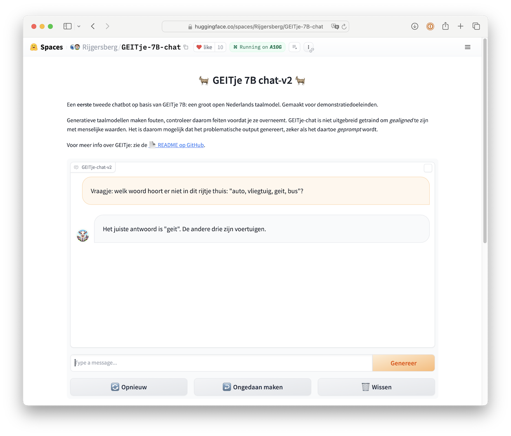
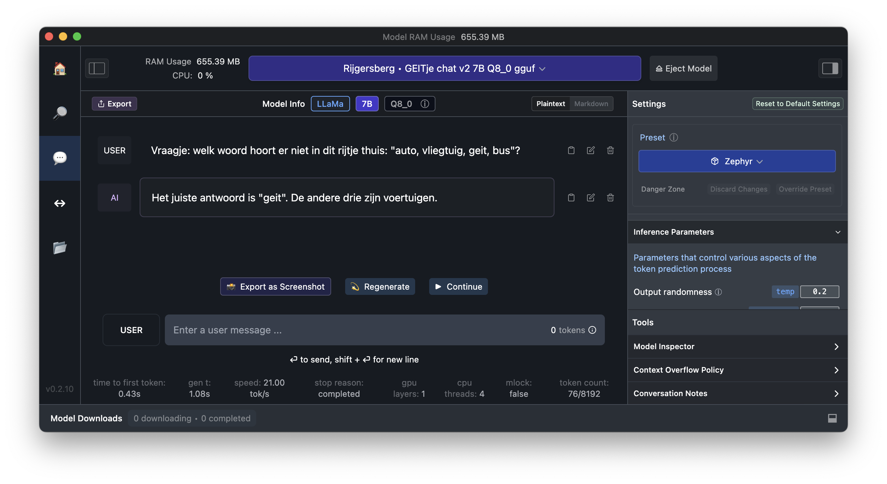
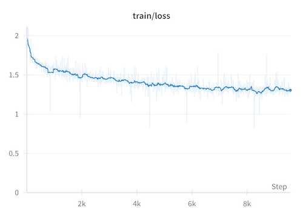
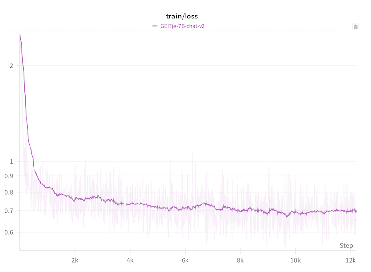
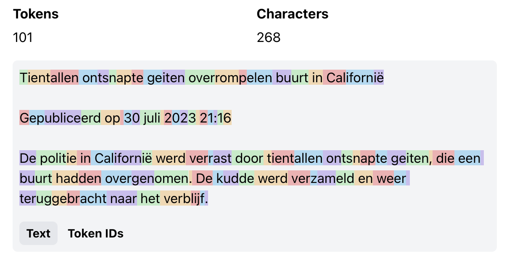

🐐 GEITje 7B: een groot open Nederlands taalmodel
=================================================
[📄 English README](./README-en.md) | 🤖️ [GEITje-chat-v2 demo](https://huggingface.co/spaces/Rijgersberg/GEITje-7B-chat)️

GEITje is een Nederlandstalig groot open taalmodel met 7 miljard parameters, gebaseerd op Mistral 7B.
Het is (verder) getraind op 10 miljard tokens aan Nederlandstalige tekst.
Daardoor heeft het beter Nederlands geleerd, en meer kennis over Nederlandse onderwerpen.

**Update 18 december 2023**: GEITje-7B-chat-v2 vrijgegeven, getraind op flink meer vertaalde chatgesprekken.<br>
**Update 4 februari 2024**: [Bram Vanroy](https://github.com/BramVanroy) heeft [GEITJE-7B-ultra](https://huggingface.co/BramVanroy/GEITje-7B-ultra) gemaakt: een superieure chatbot, getraind op meer chatdata met behulp van DPO.


📜 Licentie
-----------
GEITje is open source onder de Apache 2.0-licentie.
Dit betekent dat je GEITje – in tegenstelling tot bijvoorbeeld ChatGPT – helemaal zelf kunt draaien,
op je eigen infrastructuur en met elke (vertrouwelijke) data die je maar wilt.
Je kunt de code of het model ook zelf aanpassen of verder trainen.


🙋🏻‍♂️ Auteur
------
GEITje is een hobby-project van [Edwin Rijgersberg](https://goingdutch.ai).
Heb je iets gaafs gemaakt met GEITje? Ik hoor het graag!
Stuur me een [mail](mailto:edwin@edwinrijgersberg.nl) of een bericht op [Twitter](https://twitter.com/E_Rijgersberg) of [Mastodon](https://mastodon.social/@rijgersberg).
Of open een issue hier op GitHub natuurlijk.

Meer achtergrond over de totstandkoming van GEITje kan je vinden op mijn blog: [GoingDutch.ai](https://goingdutch.ai).


🤖 Model
--------

### _Mistral_ – Basismodel
GEITje is gebaseerd op [Mistral 7B](https://mistral.ai/news/announcing-mistral-7b/).
Dat is een groot open taalmodel met 7 miljard parameters,
getraind door [Mistral AI](https://mistral.ai).
Volgens Mistral AI presteert het 7B-model beter dan [Llama 2](https://ai.meta.com/llama/) 13B op alle (Engelstalige) benchmarks waarop ze getest hebben.
Mistral 7B is vrijgegeven onder de Apache 2.0 open source licentie.


### _GEITje_ – Doorgetraind op Nederlandstalige teksten
GEITje is gemaakt door Mistral 7B door te trainen op maar liefst 10 miljard tokens aan Nederlandstalige tekst uit het [Nederlandse Gigacorpus](http://gigacorpus.nl) en het [MADLAD-400](https://huggingface.co/datasets/allenai/MADLAD-400) webcrawling-corpus.
Het is een zogenaamde _full-parameter finetune_: 
uitgevoerd op alle parameters.
Het is dus geen [PEFT](https://huggingface.co/blog/peft) of [LoRA](https://huggingface.co/docs/peft/conceptual_guides/lora)-finetune.
Net als Mistral heeft GEITje een _context length_ van 8.192 tokens.


### _GEITje-chat_ en _GEITje-ultra_ – Gefinetuned voor dialogen
Als demonstratie voor de mogelijkheden voor chat-toepassingen van GEITje zijn er ook twee chat-varianten van GEITje gefinetuned: GEITje-chat en GEITje-chat-v2.
Ze kunnen instructies opvolgen, vragen beantwoorden en dialogen houden over allerlei onderwerpen.
GEITje-ultra is een geavanceerdere chatbot, getraind op meer data en geoptimaliseerd voor dialogen met _Direct Preference Optimization_.

### Varianten

| Model                                                                                        | Parameters | Type             | Link naar 🤗 Hugging Face Models                                                                                                                                                                                                                                             | Gebaseerd op                                                        |
|----------------------------------------------------------------------------------------------|------------|------------------|------------------------------------------------------------------------------------------------------------------------------------------------------------------------------------------------------------------------------------------------------------------------------|---------------------------------------------------------------------|
| GEITje                                                                                       | 7B         | _foundation_     | [GEITje-7B](https://huggingface.co/Rijgersberg/GEITje-7B)                                                                                                                                                                                                                    | [Mistral-7B-v0.1](https://huggingface.co/mistralai/Mistral-7B-v0.1) |
| GEITje-chat                                                                                  | 7B         | _chat SFT_       | [GEITje-7B-chat](https://huggingface.co/Rijgersberg/GEITje-7B-chat) <br><small>([gguf](https://huggingface.co/TheBloke/GEITje-7B-chat-GGUF), [gptq](https://huggingface.co/TheBloke/GEITje-7B-chat-GPTQ), [awq](https://huggingface.co/TheBloke/GEITje-7B-chat-AWQ))</small> | [GEITje-7B](https://huggingface.co/Rijgersberg/GEITje-7B)️          |
|                                                                                              | 7B         | _chat SFT_       | [GEITje-7B-chat-v2](https://huggingface.co/Rijgersberg/GEITje-7B-chat-v2) <br><small>([gguf](https://huggingface.co/Rijgersberg/GEITje-7B-chat-v2-gguf))</small>                                                                                                             | [GEITje-7B](https://huggingface.co/Rijgersberg/GEITje-7B)️          |
| GEITje-ultra*<br><small>*gecreëerd door [Bram Vanroy](https://github.com/BramVanroy)</small> | 7B         | _chat SFT + DPO_ | [BramVanroy/GEITje-7B-ultra](https://huggingface.co/BramVanroy/GEITje-7B-ultra) <br><small>([gguf](https://huggingface.co/s3nh/GEITje-7B-ultra-GGUF))</small>                                                                                                                | [GEITje-7B](https://huggingface.co/Rijgersberg/GEITje-7B)️          |


🚀 Toepassing
-------------

### Demo
Chat met GEITje-chat-v2 in de [demo](https://huggingface.co/spaces/Rijgersberg/GEITje-7B-chat) op 🤗 Hugging Face Spaces.


### 🤗 Transformers
GEITje is het beste te gebruiken met [🤗 Hugging Face Transformers](https://huggingface.co/docs/transformers/index).

```python
from transformers import pipeline, Conversation


chatbot = pipeline(task='conversational', model='Rijgersberg/GEITje-7B-chat-v2',
                   device_map='auto')

print(chatbot(
    Conversation('Welk woord hoort er niet in dit rijtje thuis: "auto, vliegtuig, geitje, bus"?')
))
# Conversation id: 602cfe35-614d-4df1-bdb5-2e29038f1d04
# user: Welk woord hoort er niet in dit rijtje thuis: "auto, vliegtuig, geitje, bus"?
# assistant: "Geitje" is het woord dat niet in dit rijtje thuishoort. Het rijtje bestaat uit allemaal vervoersmiddelen.
```

Of, als je liever meer controle hebt:
```python
import torch
from transformers import AutoModelForCausalLM, AutoTokenizer


device = 'cuda' if torch.cuda.is_available() else 'cpu'

model_name = 'Rijgersberg/GEITje-7B-chat-v2'
model = AutoModelForCausalLM.from_pretrained(model_name, torch_dtype=torch.bfloat16,
                                             low_cpu_mem_usage=True, use_flash_attention_2=True,
                                             device_map=device)
tokenizer = AutoTokenizer.from_pretrained(model_name)

def generate(conversation, temperature=0.2, top_k=50, max_new_tokens=1_000):
    tokenized = tokenizer.apply_chat_template(conversation, add_generation_prompt=True,
                                              return_tensors='pt').to(device)
    outputs = model.generate(tokenized, do_sample=True, temperature=temperature,
                             top_k=top_k, max_new_tokens=max_new_tokens)

    return tokenizer.decode(outputs[0], skip_special_tokens=True)

conversation = [
    {
        'role': 'user',
        'content': 'Welk woord hoort er niet in dit rijtje thuis: "auto, vliegtuig, geitje, bus"?'
    }
]
print(generate(conversation))
# <|user|>
# Welk woord hoort er niet in dit rijtje thuis: "auto, vliegtuig, geitje, bus"? 
# <|assistant|>
# Het woord dat niet op zijn plaats staat is 'geit'. Een geit zou niet tussen een lijst van vervoersmiddelen moeten staan. Het past beter bij een boerderijthema of dierenlijst.
```


### LM Studio
Je kunt GEITje ook gebruiken met [LM Studio](https://lmstudio.ai).
1. Gebruik de ingebouwde zoekfunctie om een model te downloaden, bijvoorbeeld `Rijgersberg/GEITje-7B-chat-v2-gguf`.
2. Gebruik de **Zephyr**-preset voor de correcte instellingen.
3. Zet de `temperature` rond de 0.2 voor de beste gebruikservaring.



### Ollama
GEITje werkt ook met [Ollama](https://ollama.ai).

1. Download een gguf-variant van GEITje, bijvoorbeeld [GEITje-7B-chat-v2.gguf](https://huggingface.co/Rijgersberg/GEITje-7B-chat-v2-gguf/tree/main).
2. Kopieer de [Modelfile](./ollama/Modelfile) uit deze repo.
3. Maak er een Ollama-model van: `$ ollama create GEITje-7B-chat-v2 -f Modelfile`.
4. Draai het model in Ollama:
```console
$ ollama run GEITje-7B-chat-v2
>>> Vraagje: welk woord hoort er niet in dit rijtje thuis: "auto, vliegtuig, geit, bus"?
Geit hoort niet in het rijtje thuis. De andere drie zijn voertuigen.
```


### Veiligheid en inzet in productie
GEITje is een [_foundation model_](https://en.wikipedia.org/wiki/Foundation_models).
Het model is getraind om teksten af te maken en is niet geoptimaliseerd voor dialoogtoepassingen.

Om GEITje zelf toe te passen kan je het finetunen op je eigen dataset.
Als je het inzet in productie, 
zorg er dan voor dat je voldoende _guardrails_ in je trainingsset hebt om het model veilig toe te passen.

In de chat-dataset van GEITje-chat zitten ook enkele voorbeelden van chatconversaties waar de assistent weigert te antwoorden,
maar het model heeft geen geavanceerde _alignment_ ondergaan.
Het is daarom mogelijk dat het problematische output genereert, zeker als het daartoe _geprompt_ wordt.

Let er ook op dat Mistral 7B als model weliswaar open source is,
maar dat Mistral AI niet bekend heeft gemaakt op welke data het getraind is.
Het is dus ook niet bekend of daar onwenselijk materiaal tussen heeft gezeten.
De trainingsdata van GEITje en GEITje-chat zijn daarentegen wel transparant.
Zie hiervoor de volgende paragrafen.


📊 Prestaties
-------------

⚠️ Work in progress ⚠️.

Het evalueren van Nederlandstalige taalmodellen staat nog in de kinderschoenen,
maar de afgelopen tijd zijn er wel flinke stappen gezet.

Wil je hieraan bijdragen? Maak een PR of schiet een issue in!


### Perplexity

Gemeten _perplexity_ op [yhavinga/mc4_nl_cleaned](https://huggingface.co/datasets/yhavinga/mc4_nl_cleaned),
de _validation_ split van de _tiny_ subset. Te reproduceren met `eval.py`.

| Model                                        | Parameters                                                              | Perplexity (lager is beter) |
|----------------------------------------------|-------------------------------------------------------------------------|-----------------------------|
| GEITje                                       | [7B](https://huggingface.co/Rijgersberg/GEITje-7B)                      | **4,70**                    |
| Mistral                                      | [7B](https://huggingface.co/mistralai/Mistral-7B-v0.1)                  | 7,99                        |
| LLaMA 2                                      | [7B](https://huggingface.co/meta-llama/Llama-2-7b-hf)                   | 8,91                        |
|                                              | [13B](https://huggingface.co/meta-llama/Llama-2-13b-hf)                 | 7,87                        |                                                                               |
|                                              | [70B](https://huggingface.co/meta-llama/Llama-2-70b-hf) (8-bit)         | 6,44                        |                                                                                  |
| BramVanroy/llama2-13b-ft-mc4_nl_cleaned_tiny | [13B](https://huggingface.co/BramVanroy/llama2-13b-ft-mc4_nl_cleaned_tiny) | 6,62                        |
| Falcon                                       | [7B](https://huggingface.co/tiiuae/falcon-7b)                           | 25,13                       |
|                                              | [40B](https://huggingface.co/tiiuae/falcon-40b) (8-bit)                 | 6,70                        |
| BramVanroy/falcon-7b-ft-mc4_nl_cleaned_tiny  | [7B](https://huggingface.co/BramVanroy/falcon-7b-ft-mc4_nl_cleaned_tiny) | 9,22                        |
| BLOOM                                        | [7B](https://huggingface.co/bigscience/bloom-7b1)                       | 34,80                       |

### Open Dutch LLM Evaluation Leaderboard

Goede datasets om taalmodellen te evalueren die onvertaalde, origineel Nederlandse data bevatten zijn schaars.

Recent is wel een leaderboard gestart voor prestaties van LLMs in het Nederlands:
Het [Open Dutch LLM Evaluation Leaderboard](https://huggingface.co/spaces/BramVanroy/open_dutch_llm_leaderboard).
Deze gebruikt vier (automatisch uit het Engels vertaalde) datasets uit het [Language Model Evaluation Harness](https://github.com/EleutherAI/lm-evaluation-harness).

Ik heb daar deze vier modellen op geëvalueerd:

| Modelnaam                                                                             | Bronmodel       | Doorgetraind op                | Gefinetuned op                                                                                                                                                                                                              |
|---------------------------------------------------------------------------------------|-----------------|--------------------------------|-----------------------------------------------------------------------------------------------------------------------------------------------------------------------------------------------------------------------------|
| [GEITje-7B](https://huggingface.co/Rijgersberg/GEITje-7B)                             | mistral-7b-v0.1 | - GigaCorpusNL<br>- MADLAD-400 |                                                                                                                                                                                                                             |
| [Mistral-7B-v0.1-chat-nl](https://huggingface.co/Rijgersberg/Mistral-7B-v0.1-chat-nl) | mistral-7b-v0.1 |                                | - [no_robots_nl](https://huggingface.co/datasets/Rijgersberg/no_robots_nl)<br>- [ultrachat_10k_nl](https://huggingface.co/datasets/Rijgersberg/ultrachat_10k_nl)                                                                                                                                                                                        |
| [GEITje-7B-chat](https://huggingface.co/Rijgersberg/GEITje-7B-chat)                   | mistral-7b-v0.1 | - GigaCorpusNL<br>- MADLAD-400 | - [no_robots_nl](https://huggingface.co/datasets/Rijgersberg/no_robots_nl)<br>- [ultrachat_10k_nl](https://huggingface.co/datasets/Rijgersberg/ultrachat_10k_nl)                                                                                                                                                                                       |
| [GEITje-7B-chat-v2](https://huggingface.co/Rijgersberg/GEITje-7B-chat-v2)             | mistral-7b-v0.1 | - GigaCorpusNL<br>- MADLAD-400 | - [no_robots_nl](https://huggingface.co/datasets/Rijgersberg/no_robots_nl)<br>- [ultrachat_10k_nl](https://huggingface.co/datasets/Rijgersberg/ultrachat_10k_nl)<br>- [dutch_chat_datasets](https://huggingface.co/datasets/BramVanroy/dutch_chat_datasets) |

Hieronder volgt een momentopname van december 2023.
Door mij getrainde modellen zijn _schuin_ weergegeven.

| Model                             | Gemiddeld | ARC      | HellaSwag | MMLU     | TruthfulQA |
|-----------------------------------|-----------|----------|-----------|----------|------------|
| zephyr-7b-beta                    | **0.49**  | 0.43     | 0.58      | **0.43** | **0.53**   |
| _mistral-7b-v0.1-chat-nl_*        | 0.48      | 0.42     | 0.63      | 0.37     | 0.49       |
| _GEITje-7B-chat_                  | 0.47      | 0.42     | **0.67**  | 0.33     | 0.46       |
| neural-chat-7b-v3-1               | 0.47      | **0.43** | 0.58      | 0.34     | 0.51       |
| _GEITJE-7B-chat-v2_*              | 0.46      | 0.42     | 0.65      | 0.33     | 0.45       |
| mistral-7b-v0.1                   | 0.46      | 0.42     | 0.58      | 0.37     | 0.45       |
| orca-2-13b                        | 0.45      | 0.42     | 0.54      | 0.37     | 0.50       |
| _GEITje-7B_                       | 0.45      | 0.38     | 0.65      | 0.32     | 0.43       |
| llama-2-13b-chat-hf               | 0.44      | 0.41     | 0.55      | 0.37     | 0.43       |
| llama2-13b-ft-mc4_nl_cleaned_tiny | 0.44      | 0.40     | 0.58      | 0.35     | 0.42       |
| llama-2-13b-chat-dutch            | 0.43      | 0.38     | 0.56      | 0.35     | 0.44       |
| llama-2-13b-hf                    | 0.43      | 0.38     | 0.57      | 0.36     | 0.41       |
| orca-2-7b                         | 0.41      | 0.37     | 0.49      | 0.33     | 0.45       |
| llama-2-7b-chat-hf                | 0.41      | 0.36     | 0.49      | 0.33     | 0.44       |
| llama-2-7b-hf                     | 0.40      | 0.36     | 0.51      | 0.32     | 0.41       |

Voorlopige conclusie hieruit kan zijn dat het doortrainen vooral heeft geholpen om de [HellaSwag](https://rowanzellers.com/hellaswag/)-score voor _common sense reasoning_ flink omhoog te krijgen.
Maar dit heeft blijkbaar niet tot betere resulaten geleid in de overige benchmarks.

**Opmerking**: pas na het draaien van de evaluaties kwam ik erachter dat het Open Dutch LLM Evaluation Leaderboard alle modellen in 8-bit-modus evalueert.
Ik heb mijn modellen in `bfloat16` geevalueerd, dus de resultaten zijn mogelijk niet vergelijkbaar.
Deze evaluaties zijn met een asterisk* gemarkeerd.
Zodra de GEITje-modellen officieel zijn opgenomen in het leaderboard zal ik bovenstaande tabel updaten met de scores.

### DUMB: A Benchmark for Smart Evaluation of Dutch Models
Wietse de Vries, Martijn Wieling en Malvina Nissim van [GroNLP](https://www.rug.nl/research/clcg/research/cl/) hebben onlangs de [DUMB benchmark](https://github.com/wietsedv/dumb) samengesteld ([website](https://dumbench.nl), [paper](https://arxiv.org/abs/2305.13026)).

Hoewel het ontworpen lijkt voor _masked language models_ zoals BERT en RoBERTa, zou het interessant zijn om te zien hoe goed GEITje daarop zero-shot, few-shot en finetuned presteert.


📚 Pre-trainen van GEITje
-------------------------
De broncode van GEITje is beschikbaar, en de trainingsdataset is samengesteld uit andere bronnen.
De code voor het samenstellen van de dataset is ook beschikbaar.
Je kunt het model dus zelf reproduceren.

### Trainingsdata
Geitje is getraind op een subset van [het Nederlandse Gigacorpus](http://gigacorpus.nl) en [MADLAD-400](https://huggingface.co/datasets/allenai/MADLAD-400).

| Databron         | Subset       | Aantal tokens in bron | Geselecteerd aantal tokens | Aantal epochs | Percentage van totaal |
|------------------|--------------|-----------------------|----------------------------|---------------|-----------------------|
| Gigacorpus       | subtitles    | 300 M                 | 100 M                      | 0,33          | 1 %                   |
| Gigacorpus       | wiki         | 375 M                 | 1.125 M                    | 3             | 11 %                  |
| Gigacorpus       | twitter      | 545 M                 | 545 M                      | 1             | 5 %                   |
| Gigacorpus       | recht        | 2.300 M               | 250 M                      | 0,11          | 3 %                   |
| Gigacorpus       | books        | 11.100 M              | 1.800 M                    | 0,16          | 18 %                  |
| Gigacorpus       | articles     | 107 M                 | 321 M                      | 3             | 3 %                   |
| Gigacorpus       | fora         | 42.500 M              | 1.000 M                    | 0,02          | 10 %                  |
| Gigacorpus-extra | dbnl         | 2.000 M               | 100 M                      | 0,05          | 1 %                   |
| Gigacorpus-extra | kamerstukken | 2.900 M               | 250 M                      | 0,09          | 3 %                   |
| MADLAD-400       | nl, clean    | 115.000 M             | 4.500 M                    | 0,04          | 45 %                  |
| **Totaal:**      |              | **177.100 M**         | **9.997 M**                | **0,06**      | **100 %**             |

Volg het volgende proces om de dataset zelf te reproduceren

1. Download de Gigacorpus-torrent van [gigacorpus.nl](http://gigacorpus.nl).
2. Pak alle bestanden uit
3. Draai `gigacorpus2hf.py` om de grote tekstbestanden te parsen tot losse documenten in Hugging Face Datasets. Let op! Dit kan behoorlijk wat schijfruimte vergen. Standaard worden de datasets meteen geupload naar de Hugging Face Hub. De bestanden uit Gigacorpus-extra zijn momenteel niet publiek.
4. Draai `create_geitje_dataset.py` om de trainingsdataset samen te stellen uit de Hugging Face Datasets van Gigacorpus en MADLAD-400.


### Pretraincode

Pretraincode is beschikbaar in `pretrain.py`.
De code is gebaseerd op Hugging Face Transformers en gebruikt de `Trainer`-API.
[Flash Attention 2](https://huggingface.co/docs/transformers/perf_infer_gpu_one#flashattention-2) zorgt voor efficiënter trainen op moderne GPUs,
en Hugging Face [Accelerate](https://huggingface.co/docs/accelerate/index) voor de ondersteuning van meerdere GPUs.

Installeer eerst de requirements:
```console
$ python3 -m pip install -r requirements.txt
```

Optioneel: login in de Hugging Face Hub en Weights & Biases met je API-keys:
```console
$ huggingface-cli login
$ wandb login
```

Start het trainen:
```console
$ python3 pretrain.py  # op 1 GPU, of
$ accelerate launch pretrain.py  # meerdere GPUs
```

### Trainingsverloop
Voor meer details over het pretrainen, zie het [rapport](https://api.wandb.ai/links/rijgersberg/0wdy6xa2) op Weights & Biases,
of de loss-grafiek hieronder.




💬 Finetunen van GEITje-chat
----------------------------
GEITje-chat is een eerste demo van mogelijke toepassingen van GEITje.


### Trainingsdata
Er is helaas heel weinig voorbeelddata van Nederlandstalige chatgesprekken openbaar beschikbaar.
[Bram Vanroy](http://bramvanroy.github.io) heeft wel [dutch_chat_datasets](https://huggingface.co/datasets/BramVanroy/dutch_chat_datasets) openbaar beschikbaar gesteld:
een dataset van automatisch vertaalde vraag-antwoord-paren van Dolly, Alpaca, Stack Overflow en Quora.
Maar ik wilde graag trainen met voorbeelden van chats met meerdere vraag-antwoord-rondes,
om het gebruik van een chatbot beter te simuleren.

Daarom heb ik twee nieuwe chat-datasets automatisch laten vertalen door GPT3.5.
Zie de scripts in `./data/chat/` voor de code daarvoor.

1. [**no_robots_nl**](https://huggingface.co/datasets/Rijgersberg/no_robots_nl):
Een vertaalde versie van alle 10k voorbeelden uit [HuggingFaceH4/no_robots](https://huggingface.co/datasets/HuggingFaceH4/no_robots).
2. [**ultrachat_10k_nl**](https://huggingface.co/datasets/Rijgersberg/ultrachat_10k_nl):
Een vertaalde versie van 10k willekeurig geselecteerde voorbeelden uit de 200k voorbeelden in [HuggingFaceH4/ultrachat_200k](https://huggingface.co/datasets/HuggingFaceH4/ultrachat_200k).

Deze twee datasets vormen samen de trainingsdata voor GEITje-chat.


### Finetunecode

Tijdens het finetunen van GEITje-chat is er gebruik gemaakt van de `SFTrainer`-API uit [trl](https://huggingface.co/docs/trl/index)
en is [NEFTune](https://arxiv.org/abs/2310.05914) toegepast.
Er is wederom op alle parameters getraind.

Optioneel: login in de Hugging Face Hub en Weights & Biases met je API-keys:
```console
$ huggingface-cli login
$ wandb login
```

Start het finetunen:
```console
$ python3 finetune.py
```

### Trainingsverloop

#### GEITje-chat
GEITje-chat is 3 epochs getraind.
Om het effect van de pretraining te onderzoeken heb ik ook het basismodel Mistral 7B v0.1 exact dezelfde training laten ondergaan.
Dit model noem ik [Mistral-7B-v0.1-chat-nl](https://huggingface.co/Rijgersberg/Mistral-7B-v0.1-chat-nl).

Voor meer details over het finetunen, zie het [rapport](https://api.wandb.ai/links/rijgersberg/b8rlturu) op Weights & Biases,
of de loss-grafiek hieronder.


#### GEITje-chat-v2
GEITje-chat-v2 is getraind op dezelfde dataset als v1,
maar aangevuld met [BramVanroy/dutch_chat_datasets](https://huggingface.co/datasets/BramVanroy/dutch_chat_datasets).

Er is getrained op één epoch. Zie de loss-grafiek hieronder.




🧮 Compute
----------
GEITje is getraind in de [Lambda Labs Cloud](https://lambdalabs.com), op een instance met 8x NVIDIA H100 80 GB GPUs.
Trainen nam 526 GPU-uur in beslag,
met een geschat energieverbruik van 350 kWh.
Ter vergelijking: het vanaf niets trainen van Llama 2 7B door Meta gebruikte [184.320](https://arxiv.org/abs/2307.09288) GPU-uur
en kostte ongeveer 74.000 kWh.

GEITje-chat en GEITje-chat-v2 zijn beiden getraind in de cloud van [RunPod](https://www.runpod.io), op een instance met 1x NVIDIA A100 80GB.
Trainen nam 10,5 GPU-uur per stuk in beslag,
met een geschat energieverbruik van 5 kWh.


🔡 Tokenizer
------------
Omdat GEITje is gebaseerd op Mistral 7B, gebruikt het ook de tokenizer van Mistral 7B.
Wees je ervan bewust dat deze tokenizer niet is geoptimaliseerd voor het Nederlands.
Je teksten kunnen opgedeeld worden in meer tokens dan je misschien gewend bent.

- GEITje:


- [GroNLP/gpt2-small-dutch](https://huggingface.co/GroNLP/gpt2-small-dutch):


Visualisaties door [Tokenwiz](https://tokenwiz.rahul.gs).
Voor meer vergelijkingen tussen tokenizers voor het Nederlands heeft [Yeb Havinga](https://github.com/yhavinga) onlangs de [Dutch Tokenizer Arena](https://huggingface.co/spaces/yhavinga/dutch-tokenizer-arena) gemaakt!


💐 Dankwoord
------------
Een speciaal dankwoord aan Bob Lucassen, zonder wie GEITje nooit had kunnen bestaan.
Niet alleen heeft hij het [Nederlandse Gigacorpus](http://gigacorpus.nl) samengesteld en gepubliceerd,
maar hij heeft ook actief bijgedragen aan het verwerken van het corpus en gezorgd voor aanvullende data.
Bekijk ook eens zijn [Petje af](https://petjeaf.com/onnodigcomplex).


⏩ Vervolg
----------
GEITje is weliswaar een van de eerste grote Nederlandstalige taalmodellen die verder getraind is op een grote hoeveelheid Nederlandstalige tekst,
maar het is getraind met een budget dat minuscuul is ten opzichte van de miljoenen die voor taalmodellen voor andere talen worden uitgetrokken.
Ik hoop dat GEITje een startpunt is voor een serie aan innovatieve, *open* applicaties vanuit de Nederlandstalige AI-gemeenschap.

TNO, SURF en NFI hebben [subsidie gekregen](https://www.rijksoverheid.nl/ministeries/ministerie-van-economische-zaken-en-klimaat/nieuws/2023/11/02/14-nederlandse-onderzoeksfaciliteiten-krijgen-184-miljoen-euro-ondersteuning) van het Ministerie van Economische Zaken en Klimaat om een groot Nederlandstalig taalmodel te ontwikkelen in 2024 en 2025: [GPT-NL](https://www.tno.nl/nl/newsroom/2023/11/nederland-start-bouw-gpt-nl-eigen-ai/).
Het is nog niet bevestigd of de gewichten daarvan openbaar beschikbaar zullen zijn, en zo ja onder welke licentie.
Hopelijk kan GEITje een voorbeeld zijn van wat er mogelijk is met open source.

Ga je zelf ook met grote taalmodellen aan de slag, en ben je van plan het grootser aan te pakken dan GEITje?
Neem dan vooral [contact op](mailto:edwin@edwinrijgersberg.nl)!

🔬 Gebruik van GEITje-7B in de wetenschap
-----------------------------------------
GEITje-7B, of een van de afgeleide modellen, zijn gebruikt in de volgende wetenschappelijke werken:

- Vanroy, Bram. "Language resources for Dutch large language modelling." _arXiv preprint arXiv:2312.12852_ (2023).
- Terryn, Ayla Rigouts, and Miryam de Lhoneux. "Exploratory Study on the Impact of English Bias of Generative Large Language Models in Dutch and French." _Proceedings of the Fourth Workshop on Human Evaluation of NLP Systems (HumEval)@ LREC-COLING 2024_. 2024.
- Suijkerbuijk, Michelle, et al. "BLiMP-NL."
- Sinnaeve, Wout, Orphée De Clercq, and Joni Kruijsbergen. "Controlled Text Simplification for Dutch Using Generative Large Language Models."
- Snoeij, C. AI for GovTech - Exploring the use of LLMs for GovTech Benchmark Operationalization. _Master Thesis, Delft University of Technology_, 2024. 
- Bakker, Femke. Assessing Large Language Models for Accurate Long Dutch Document Classification. _Master Thesis, University of Amsterdam_, 2024.
- Rogiers, Alexander, et al. "KamerRaad: Enhancing Information Retrieval in Belgian National Politics Through Hierarchical Summarization and Conversational Interfaces." _Joint European Conference on Machine Learning and Knowledge Discovery in Databases_. Cham: Springer Nature Switzerland, 2024.
- Weering, Sanne, and Tommaso Caselli. "FC_RUG at CheckThat! 2024: few-shot learning using GEITje for check-worthiness detection in Dutch." _25th Working Notes of the Conference and Labs of the Evaluation Forum, CLEF 2024_. CEUR Workshop Proceedings (CEUR-WS. org), 2024.
- Thakkar, Gaurish, et al. "Building a Large Language Model for Moderately Resourced Language: A Case of Croatian." _35th International Scientific Conference Central European Conference on Information and Intelligent Systems Proceedings_. Fakultet organizacije i informatike;, 2024.
- Jain, Devansh, et al. "PolygloToxicityPrompts: Multilingual Evaluation of Neural Toxic Degeneration in Large Language Models." _arXiv preprint arXiv:2405.09373_ (2024).
- Redelaar, F., et al. "Attributed Question Answering for the Dutch Law using Retrieval augmented Large language models", _The 34th Meeting of Computational Linguistics in The Netherlands_, 2024.
- Debaene, F., et al. "Do we still need specialized transformers? A comparison to generative foundation models for non-normative Dutch", _The 34th Meeting of Computational Linguistics in The Netherlands_, 2024.
- Sinnaeve, W., et al. "Controlled Text Simplification for Dutch using Generative Large Language Models", _The 34th Meeting of Computational Linguistics in The Netherlands_, 2024.
- Chen, S., et al. "Automated Pass/Fail Classification for Dutch as a Second Language Using Large Language Models", _The 34th Meeting of Computational Linguistics in The Netherlands_, 2024.
- Grotti, L. "Evaluating Grapheme-to-Phoneme Conversion and Syllable Counting of Large Language Models for Dutch", _The 34th Meeting of Computational Linguistics in The Netherlands_, 2024.
- Noels, Sander, Jorne De Blaere, and Tijl De Bie. "A Dutch Financial Large Language Model." _arXiv preprint arXiv:2410.12835_ (2024).
- Vanroy, Bram. "GEITje 7B Ultra: A Conversational Model for Dutch." _arXiv preprint arXiv:2412.04092_ (2024).
- Meeus, M., Rathé, A., Remy, F., Delobelle, P., Decorte, J. J., & Demeester, T. "ChocoLlama: Lessons Learned From Teaching Llamas Dutch." _arXiv preprint arXiv:2412.07633_ (2024).


📎 Referentie
-------------
Als je gebruik maakt van GEITje kan je de volgende referentie gebruiken:
```
@misc{rijgersberg2023geitje,
      title = {GEITje: een groot open Nederlands taalmodel},
      shorttitle = {GEITje},
      author = {Rijgersberg, Edwin  and  Lucassen, Bob},
      year = {2023},
      month = dec,
      url = {https://github.com/Rijgersberg/GEITje}
}
```
